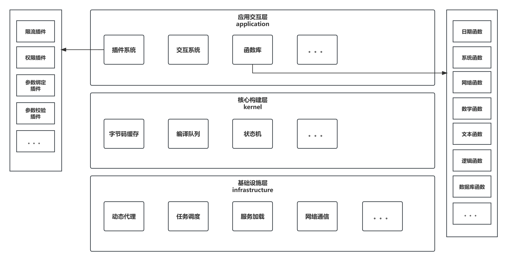

# **USL —— Universal Script Language** (通用脚本语言)

<p style="text-align:center">


</p>

<br/>

## 一、简介
> `USL`是一个通用脚本语言开发框架，核心实现基于`Aviator`脚本引擎，并在其基础上做了大量的封装与扩展，
以满足更多更复杂的实际业务场景。所有的内置插件与机制都支持动态删除或替换，主要特性包括但不限于：
1. **更灵活的函数定义**：可以为任意类或方法(静态或非静态)创建自定义函数，且无需实现`AviatorFunction`接口
2. **更丰富的功能插件**，在函数执行前、执行后、执行成功时、执行失败时、执行完成时，提供功能扩展
3. **更完整的调用堆栈**，对于每一次函数调用，保存调用时的子表达式内容、参数信息、异常信息、调用结果
4. **更强大的参数校验**，对函数的参数类型、参数个数、参数大小、返回值类型等常见场景进行校验
5. **更实用的性能优化**，例如使用`Caffeine`替代原有的`LRU-Map`缓存，提供脚本引擎执行全生命周期监听器等
6. **更方便的交互选项**，可以使用生产者-消费者(`Disruptor`)队列模式，也可以使用`CLI`命令行模式，也可以使用`WEB`模式交互


## 二、整体架构


## 三、内置功能与插件
- 缓存插件、异步插件、日志插件、监控插件、参数绑定插件、参数校验插件、限流插件、权限插件、重试插件等
- 网络函数、系统函数、数据库函数、文本处理函数、数学函数、加解密函数、日期函数、逻辑函数、集合函数等

## 四、代码合并【新增特性 或 修复缺陷】
1. 拉取远程`master`主分支，更新本地分支，确保本地获取的是最新版代码
2. 从本地`master`分支切出一个新分支并重命名，通常与新增特性或缺陷内容相关
3. 在本地新分支完成开发并测试
4. 再次更新本地`master`分支，并将本地`master`分支合并到新分支上，确保无代码冲突
5. 发起`pull request`，将本地新分支合并到远程`master`主分支上，并等待审核

## 五、安装与使用
> 项目于`2023年9月12日`正式立项，计划第一个正式版本于`2024年1月1日`正式发布
```
It will be developed soon, please looking forward to it
```